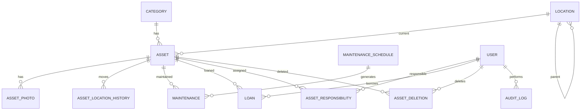

# Rancangan Modul Inventaris & Pemeliharaan Aset

Dokumen ini merangkum rancangan model data, ERD, dan alur implementasi sesuai SRS terbaru.

## 1. ERD (Mermaid)

## 2. Model Data (Django)

Catatan umum:
- Soft delete menggunakan `deleted_at` pada `Asset`, tanpa fitur restore.
- Audit trail mencatat perubahan status dan field penting: lokasi, penanggung jawab, kondisi.
- QR code berisi kode + data ringkas, dan saat scan menuju halaman detail aset.

### 2.1 Category
- `id`
- `code` (char, unique)
- `name` (char)
- `is_active` (bool)
- `created_at`, `updated_at`

### 2.2 Location (hierarki bertingkat)
- `id`
- `name` (char)
- `parent` (FK to Location, null)
- `path` (char, optional, untuk query hierarki cepat)
- `is_active` (bool)
- `created_at`, `updated_at`

### 2.3 Asset
- `id`
- `code` (char, unique, format YYYY-MM-COUNTER, reset per bulan berdasarkan `acquired_date`)
- `name` (char)
- `category` (FK Category)
- `acquired_date` (date)
- `status` (choices: AKTIF, DIPINJAM, RUSAK, DIHAPUS)
- `condition` (choices: BAIK, RUSAK_RINGAN, RUSAK_BERAT)
- `current_location` (FK Location)
- `created_by`, `updated_by` (FK User)
- `deleted_at` (datetime, null)
- `created_at`, `updated_at`

Index:
- unique `code`
- index `status`, `category`, `current_location`

### 2.4 AssetResponsibility (M2M Asset - User)
- `asset` (FK Asset)
- `user` (FK User)
- `assigned_at` (datetime)

Unique:
- (`asset`, `user`)

### 2.5 AssetLocationHistory
- `asset` (FK Asset)
- `from_location` (FK Location, null)
- `to_location` (FK Location)
- `moved_at` (datetime)
- `moved_by` (FK User)
- `note` (text, optional)

### 2.6 AssetPhoto
- `asset` (FK Asset)
- `image` (ImageField)
- `caption` (char, optional)
- `uploaded_by` (FK User)
- `uploaded_at` (datetime)

### 2.7 MaintenanceSchedule
- `asset` (FK Asset)
- `period` (choices: HARIAN, MINGGUAN, BULANAN, TAHUNAN)
- `next_due_date` (date)
- `last_done_at` (datetime, null)
- `status` (choices: TEPAT_WAKTU, TERLAMBAT)
- `created_by` (FK User)
- `created_at`, `updated_at`

### 2.8 Maintenance
- `asset` (FK Asset)
- `type` (choices: RUTIN, INSIDENTAL)
- `schedule` (FK MaintenanceSchedule, null)
- `condition_before` (choices: BAIK, RUSAK_RINGAN, RUSAK_BERAT)
- `condition_after` (choices: BAIK, RUSAK_RINGAN, RUSAK_BERAT)
- `cost` (decimal, catatan non-keuangan)
- `performed_at` (datetime)
- `note` (text, optional)
- `created_by` (FK User)
- `created_at`

### 2.9 Loan
- `asset` (FK Asset)
- `borrower` (FK User)
- `borrowed_at` (datetime)
- `planned_return_at` (date)
- `returned_at` (datetime, null)
- `note` (text, optional)
- `created_by` (FK User)

### 2.10 AssetDeletion
- `asset` (FK Asset)
- `reason` (text)
- `deleted_by` (FK User)
- `deleted_at` (datetime)

### 2.11 AuditLog
- `entity` (char, contoh: "asset")
- `entity_id` (int)
- `action` (char, contoh: create/update/status_change)
- `changes` (JSON, {field: {before, after}})
- `performed_by` (FK User)
- `performed_at` (datetime)

## 3. Alur Implementasi

### 3.1 Master Data
- CRUD kategori dan lokasi.
- Lokasi mendukung hierarki (Gedung -> Ruang -> sub-ruang bila perlu).

### 3.2 Pendaftaran Aset
- Input data, generate `code` berdasarkan `acquired_date` (YYYY-MM-COUNTER, reset per bulan).
- Simpan lokasi awal dan penanggung jawab (M2M).
- Generate QR code berisi kode + data ringkas, link ke detail aset.
- Cetak label dari halaman detail.

### 3.3 Mutasi Lokasi
- Update `current_location`, simpan ke `AssetLocationHistory`.
- Audit log untuk perubahan lokasi.

### 3.4 Peminjaman
- Buat `Loan`, set status aset ke DIPINJAM.
- Saat pengembalian, isi `returned_at`, status kembali AKTIF.

### 3.5 Pemeliharaan
- Rutin: dibuat dari jadwal.
- Insidental: input manual.
- Simpan kondisi sebelum/sesudah, biaya, foto.
- Kondisi aset bisa diubah di luar pemeliharaan.

### 3.6 Jadwal Pemeliharaan
- `next_due_date` dihitung dari `period`.
- Status TERLAMBAT jika lewat >= 1 hari.
- Reminder hanya di dashboard (query due/overdue).

### 3.7 Penghapusan Aset
- Input alasan, set status DIHAPUS, set `deleted_at`.
- Tidak ada fitur restore.

### 3.8 Laporan
- Laporan daftar aset (filter status/kategori/lokasi).
- Laporan pemeliharaan (filter periode/tipe).
- Export PDF dan Excel.

## 4. Rancangan URL (Draft)

- `/inventaris/aset/`
- `/inventaris/aset/tambah/`
- `/inventaris/aset/<id>/`
- `/inventaris/aset/<id>/edit/`
- `/inventaris/aset/<id>/hapus/`
- `/inventaris/aset/<id>/label/`
- `/inventaris/aset/<id>/mutasi/`
- `/inventaris/aset/<id>/pinjam/`
- `/inventaris/aset/<id>/kembali/`
- `/inventaris/aset/<id>/pemeliharaan/`
- `/inventaris/jadwal/`
- `/inventaris/jadwal/tambah/`
- `/inventaris/laporan/aset/`
- `/inventaris/laporan/pemeliharaan/`

## 5. Aturan Penting

- Kode aset harus unik dan konsisten (reset counter per bulan).
- Asset yang dihapus (soft delete) tidak muncul di listing default.
- Audit log wajib untuk status, lokasi, PJ, kondisi.
- QR code mengarah ke detail aset.
